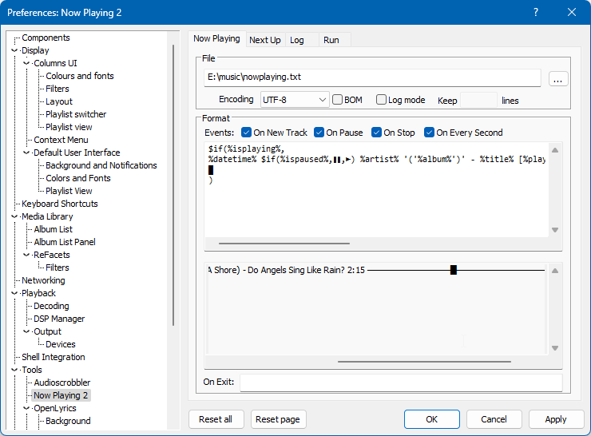
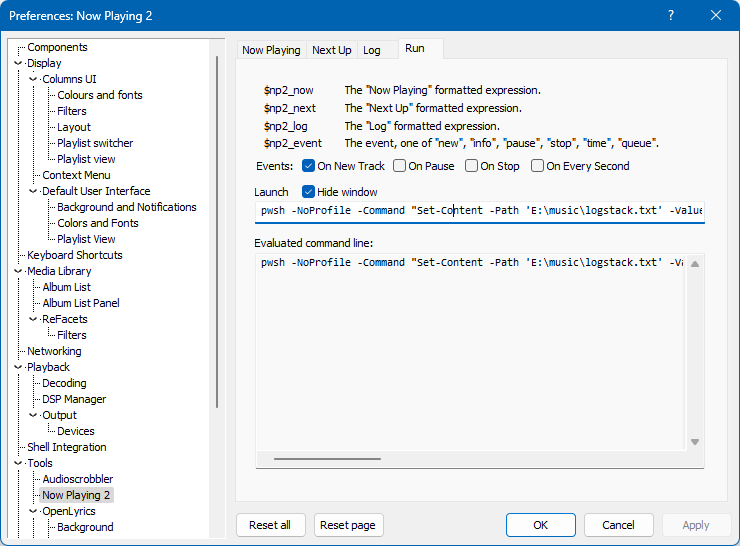

# foo_nowplaying2

Component for foobar2000 to generate "now playing" text, clipboard or file.

## Installation

Open `foo_nowplaying2.fb2k-component` to install it into foobar2000.

## Features

### Now tab

To generate a "progress bar" in the "now" tab, use the following title
formatting code:

```txt
$if(%isplaying%,
%datetime% $if(%ispaused%,❚❚,►) %artist% '('%album%')' - %title% [%playback_time%] [$progress(%_time_elapsed_seconds%, %_time_total_seconds%, 30,'█','─')] [%length%]    ,
█
)
```

to obtain:

```txt
2024-10-06 21:26:33 ► Weather Systems (Ocean Without A Shore) - Do Angels Sing Like Rain? 3:14 ───────────────────█────────── 5:06
```



Note that this progress bar requires the "On Every Second" event toggle, so
it updates.

### `%datetime%` custom field

In the `Now Playing 2` tabs, for titleformatting the new `%datetime%` expression
can be used in the inputs. It evaluates to "now", into strings like
`2024-04-24 23:45:01`.

### Run tab

There is also a "Run" tab that allows launching command lines in the cmd / bat
syntax. To create a file `E:\music\logstack.txt` that logs the songs played with
the newest at top, use:

```txt
pwsh -NoProfile -Command "Set-Content -Path 'E:\music\logstack.txt' -Value $('$np2_log'; Get-Content -ErrorAction Ignore 'E:\music\logstack.txt')"
```

Use the cmd / conhost / `CreateProcess` syntax, not the pwsh / PowerShell one.



## Release version download

Get it on GitHub from
[Releases](https://github.com/foxx1337/foo_nowplaying2/releases).

Use the `-with-debug` versions if needed to generate meaningful crash dumps.

Inside *foobar2000*, go to `Properties` - `Components` and select the `Install...`
button, point the dialog to the downloaded `foo_nowplayin2.fb2k-component`
archive.

## Building

1. Download the [foobar2000 SDK](https://www.foobar2000.org/SDK), extract its
   contents to `path\to\sdk` and open the single solution file,
   `path\to\sdk\foobar2000\foo_sample\foo_sample.sln`.

   [WTL 10](https://sourceforge.net/projects/wtl/) is needed, extracted at a
   location such as `other\path\to\wtl\`. For every one of the:

      * `foo_sample`
      * `foobar2000_sdk_helpers`
      * `libPPUI`

   subprojects, edit in Visual Studio the properties for
   **All Configurations**/**All Platforms** under
   **Configuration Properties** -> **C/C++** -> **General**
   and add the WTL headers path, `other\path\to\wtl\Include`, to
   **Additional Include Directories**.

2. Build the foobar2000 sample project for `Debug` and `Release`. The included
   settings target **Win32**. It's fine to generate configurations for **x64**
   and **ARM64EC** based on **Win32**.

   Project **pfc** is special: for **Debug** and, respectively, **Release**, for
   any **Active solution platform**, select **Debug FB2k** and, respectively,
   **Release FB2K** in the Visual Studio **Configuration Manager**.

3. Switch to the **foo_nowplaying2** directory and generate the Visual Studio
   solution, explicitly referencing the **Win32**, **x64** or **ARM64**
   architecture and the **foobar2000sdk** path:

   ```pwsh
   mkdir build
   cd build
   cmake .. -AWin32 -Dfoobar2000sdk="path\to\sdk" -Dwtl="other\path\to\wtl"

   cd ..
   mkdir build64
   cd build64
   cmake .. -Ax64 -Dfoobar2000sdk="path\to\sdk" -Dwtl="other\path\to\wtl"

   cd ..
   mkdir buildARM64EC
   cd buildARM64EC
   cmake .. -AARM64EC -Dfoobar2000sdk="path\to\sdk" -Dwtl="other\path\to\wtl"
   ```

4. Open the generated **foo_nowplaying2.sln** solution, build it and use the
   resulting `build\src\<Debug|Release>\foo_nowplaying2.dll` in foobar2000,
   under the `user-components` directory.
